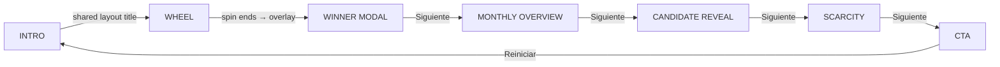

# 🎬 RULETA FILOSÓFICA — Director's Playbook

> **Format:** TikTok / Reels / Shorts (9:16 vertical)
> **Framerate:** 60fps · **Resolution:** 1080×1920 (rendered into `recording-pane`)
> **Total Runtime:** ~35–45 seconds (adjustable via Dev Panel)

---

## 📐 Stage Layout

```
┌──────────────────────────────────────────────────────┐
│                  BROWSER WINDOW                      │
│  ┌──────────────────┐  ┌──────────────────────────┐  │
│  │                  │  │                          │  │
│  │  RECORDING PANE  │  │      DEV PANEL           │  │
│  │  (9:16 ratio)    │  │  ┌──────────────────┐    │  │
│  │                  │  │  │ Screen Controls  │    │  │
│  │  ← THIS IS THE   │  │  │  ← Anterior      │    │  │
│  │    VIDEO OUTPUT   │  │  │  Siguiente →     │    │  │
│  │                  │  │  │  REINICIAR TODO   │    │  │
│  │  width:           │  │  └──────────────────┘    │  │
│  │  min(100vh*9/16,  │  │  ┌──────────────────┐    │  │
│  │      100vw)       │  │  │ Grabación        │    │  │
│  │                  │  │  └──────────────────┘    │  │
│  │                  │  │  ┌──────────────────┐    │  │
│  │                  │  │  │ Gestión / Config │    │  │
│  └──────────────────┘  │  └──────────────────┘    │  │
│                        └──────────────────────────┘  │
└──────────────────────────────────────────────────────┘
```

- The **Recording Pane** is the only content that gets exported as video.
- All overlays (`WinnerModal`, `PhraseScreen`) use `position: absolute` scoped to this pane.
- The **Dev Panel** is off-screen in the final recording.

---

## 🎞️ SCENE BREAKDOWN

### Phase Pipeline

```
INTRO ──→ WHEEL ──→ WINNER MODAL ──→ MONTHLY OVERVIEW ──→ CANDIDATE REVEAL ──→ SCARCITY ──→ CTA
  1          2            2b                  3                    4                5           6
```

Each phase is advanced from the Dev Panel via **Siguiente →** (or automatically in Bot Mode).

---

## 🎬 SCENE 1 — INTRO

> **File:** `page.tsx` · **Phase ID:** `intro`
> **Duration:** 2–3 seconds · **Mood:** Cinematic, mysterious

### What's on screen

| Layer | Element | Position | Style |
|-------|---------|----------|-------|
| BG | Solid black `#000` | Full frame | — |
| FG | **"RULETA FILOSÓFICA"** | Dead center | `Outfit 900`, 3.5rem, white, uppercase, `letterSpacing: 4px` |

### Animation

| Element | Property | From → To | Easing | Duration |
|---------|----------|-----------|--------|----------|
| Title | `opacity` | `0 → 1` | default | 0.3s |

### Sound

| Trigger | Sound | File |
|---------|-------|------|
| Phase enters | Intro ping | `ruleta_filosofica_notification.wav` |

### Transition OUT → Scene 2

| Property | From → To | Type | Notes |
|----------|-----------|------|-------|
| Title | `layoutId="main-title"` | Shared layout | Physically moves and shrinks to header position |
| Entire scene | `opacity: 1 → 0` | `AnimatePresence exit` | Crossfade |

---

## 🎬 SCENE 2 — THE WHEEL

> **File:** `page.tsx` + `Wheel.tsx` · **Phase ID:** `wheel`
> **Duration:** Variable (~10–15s including spin) · **Mood:** Anticipation

### What's on screen

| Layer | Element | Position | Style |
|-------|---------|----------|-------|
| BG | `::before` animated gradient (from `.recording-pane`) | Full frame | Purple/pink radials, drifting animation |
| BG | `::after` floating particles | Full frame | Dot grid, diagonal drift |
| HEADER | **"RULETA FILOSÓFICA"** | Top center, `paddingTop: 100px` | `Outfit 900`, 2.2rem, shared `layoutId` |
| HEADER | **"¿Cuál será el Tema de hoy?"** | Below title | Fades in with `delay: 0.5` |
| MAIN | **Wheel Canvas** | Center, `width: 90%, aspect-ratio: 1/1` | 8 colored segments, Kibo pointer |

### Wheel Segment Colors (clockwise)

| Topic | Color | Hex |
|-------|-------|-----|
| DINERO | Neon Emerald | `#00ffa3` |
| AMOR | Electric Crimson | `#ff004c` |
| ANSIEDAD | Hyper Purple | `#7a5fff` |
| SALUD | Sky Turquoise | `#00d1ff` |
| ÉXITO | Brilliant Gold | `#ffbd00` |
| FELICIDAD | Vibrant Orange | `#ff5c00` |
| TIEMPO | Sleek Chrome | `#94a3b8` |
| SOLEDAD | Deep Fuchsia | `#c026d3` |

### Spin Mechanics (in `Wheel.tsx`)

```
Spin Duration:  Matches wheel-spin.wav length
Easing:         cubic-bezier(0, 0, 0.2, 1) — fast start, gentle stop
Min Rotations:  5 full turns + random offset
Tick Sound:     Every segment boundary crossing (all ticks, no threshold)
```

### Animation

| Element | Property | From → To | Easing | Trigger |
|---------|----------|-----------|--------|---------|
| Subtitle | `opacity` | `0 → 1` | ease | `delay: 0.5` |
| Whole scene | `opacity` | `0 → 1` | ease | Phase enter |

### Sound

| Trigger | Sound | File |
|---------|-------|------|
| Phase enters | Wheel appears | `wheel_appears.wav` |
| Spin starts | Looping spin | `wheel-spin.wav` (loop) |
| Each segment | Tick | `tick.wav` (cloned per tick) |
| Spin ends | Win fanfare | `wheel-win.wav` |
| Spin ends | Applause | `girls_applause.wav` |

### Interaction

- **Dev Panel "Siguiente (GIRAR)"** → calls `wheelRef.current.spin()`
- **Bot Mode** → auto-spins after component mount

---

## 🎬 SCENE 2b — WINNER MODAL (overlay)

> **File:** `WinnerModal.tsx` · **Overlays Scene 2**
> **Duration:** 2.5 seconds · **Mood:** Celebration

### What's on screen

| Layer | Element | Position | Style |
|-------|---------|----------|-------|
| OVERLAY | Dark blur | Full frame | `rgba(0,0,0,0.8)`, `backdrop-filter: blur(12px)` |
| GLOW | Radial glow | Center | `radial-gradient(circle, ${winnerColor}44, transparent 65%)` |
| CARD | Glass card `.modal-content` | Center | `border: ${winnerColor}44`, z-index: 10 |
| TEXT | **"TEMA GANADOR"** | Inside card, top | `0.8rem`, `letterSpacing: 4px`, `opacity: 0.8` |
| TEXT | **Winner Name** (e.g. "ÉXITO") | Inside card, main | Shimmer gradient, `clamp(1.5rem, 8vw, 2.8rem)`, 900 weight |
| FX | Confetti | Both sides | Custom canvas, z-index: 5 |

### Confetti Config

```js
{
  particleCount: 8,          // per side, per frame
  angle: 60 / 120,           // left / right
  spread: 55,
  origin: { x: 0|1, y: 0.6 },
  colors: [winnerColor, '#ffffff', '#ffbd00'],
  duration: 2500ms,
  canvas: local <canvas> (not document body)
}
```

### Shimmer Animation

```css
@keyframes titleShimmer {
  0%   { background-position: -200% center }
  100% { background-position: 200% center }
}
/* Duration: 3s, linear, infinite */
```

### Transition OUT → Scene 3

- **Manual:** Dev Panel "Siguiente →" advances `previewPhase` to `monthly-overview`
- The `WinnerModal` disappears when `previewPhase !== 'wheel'`

---

## 🎬 SCENE 3 — MONTHLY OVERVIEW

> **File:** `PhraseScreen.tsx` · **Phase ID:** `monthly-overview`
> **Duration:** 4–5 seconds · **Mood:** Dashboard, status report

### Background

```
Dynamic background (4-corner radial-gradient):
  radial-gradient(circle at 15% 15%, ${topicColor}55, transparent 45%)
  radial-gradient(circle at 85% 85%, ${topicColor}44, transparent 45%)
  radial-gradient(circle at 85% 15%, ${topicColor}33, transparent 40%)
  radial-gradient(circle at 15% 85%, ${topicColor}22, transparent 40%)
  #07060f
```

### What's on screen

| Layer | Element | Position | Style |
|-------|---------|----------|-------|
| TITLE | **"FRASES DE MARZO"** | Top center | `Outfit 900`, 2rem, white, uppercase, `letterSpacing: 4px` |
| LIST | 8 Topic Cards (scrollable) | Below title, stacked vertically | `maxWidth: 400px`, winner topic at top |

### Topic Card Layout

```
┌─────────────────────────────────────────────┐
│  ● DINERO                      2/4 REVELADAS│  ← header row
│  ┌──────────────┐  ┌──────────────┐         │
│  │ ✓ Author     │  │ ✓ Author     │         │  ← used slots (2x2 grid)
│  │ "phrase..."  │  │ "phrase..."  │         │
│  └──────────────┘  └──────────────┘         │
│  ┌──────────────┐  ┌──────────────┐         │
│  │ ✨ AHORA     │  │ 🔒           │         │  ← current reveal + upcoming
│  │ (pulsing)   │  │ (blurred)   │         │
│  └──────────────┘  └──────────────┘         │
└─────────────────────────────────────────────┘
```

#### Slot States

| State | Visual | Icon | Border |
|-------|--------|------|--------|
| `REVELADA` (used) | Author + truncated phrase text | `CheckCircle2` (12px, topic color) | `1px solid rgba(255,255,255,0.05)` |
| `AHORA` (current) | Glowing, pulsing box-shadow | `Sparkles` (12px, topic color) | `1px solid ${topicColor}80` |
| `MISTERIO` (upcoming) | Blurred lock | `Lock` (10px, dim white) | `1px solid rgba(255,255,255,0.05)` |
| `COMPLETADO` (4/4) | Header badge says "COMPLETADO" | — | — |

### Animation

| Element | Property | From → To | Easing | Notes |
|---------|----------|-----------|--------|-------|
| Whole phase | `y` | `-100vh → 0` | spring (damping: 30, stiffness: 150) | Slides down from top |
| Title | `y, opacity` | `-100, 0 → 0, 1` | default | |
| Topic cards | stagger | `y: -200, opacity: 0 → y: 0, opacity: 1` | spring (damping: 25, stiff: 120) | `staggerChildren: 0.1`, `delayChildren: 0.4` |
| AHORA slot | `boxShadow` | pulse between `5px` and `15px` glow | `repeat: Infinity, duration: 2s` | |

### Sort Order

The **winner topic** is always sorted to position #1 in the list. All other topics follow in their default order.

---

## 🎬 SCENE 4 — CANDIDATE REVEAL

> **File:** `PhraseScreen.tsx` · **Phase ID:** `candidate-reveal`
> **Duration:** 5 seconds · **Mood:** Dramatic unveiling

### What's on screen

| Layer | Element | Position | Style |
|-------|---------|----------|-------|
| BG | Dynamic 4-corner gradient (same as Scene 3) | Full frame | Tinted with winner color |
| BADGE | **"Ganador: {TOPIC}"** | Top center | Pill badge, `bg: topicColor`, text: black, `0.8rem` |
| GLOW | Radial blur | Behind phrase | `radial-gradient(circle, ${topicColor}30, transparent 70%)`, `filter: blur(30px)` |
| ICON | ✨ Sparkles | Top-right corner of phrase | `color: topicColor` |
| PHRASE | **"La frase revelada..."** | Center, large | `Outfit 700`, `1.8rem`, white, wrapped in quotes |
| AUTHOR | **"— Séneca"** | Below phrase | `topicColor`, `1.1rem`, `fontWeight: 600` |
| HINT | Bouncing `ChevronRight` | Bottom center | `32px`, white, `animate-bounce` |

### Animation

| Element | Property | From → To | Easing | Delay |
|---------|----------|-----------|--------|-------|
| Whole phase | `opacity, scale` | `0, 1.1 → 1, 1` | ease | — |
| Badge | `y, opacity` | `20, 0 → 0, 1` | ease | `0.5s` |
| Phrase block | `scale, opacity` | `0.8, 0 → 1, 1` | spring | `0.8s` |
| Author | `opacity` | `0 → 1` | ease | `1.5s` |
| Chevron hint | `opacity` | `0 → 1` | ease | `2.5s` |

### Data Logic

```
1. Filter allRows by TEMA === topicId AND USADA === 'FALSE'
2. Pick first unused phrase → setRevealedPhrase(phrase)
3. Locally mark as USADA: 'TRUE' with today's date (immediate UI feedback)
4. Phrase is split on [–—-] to extract:
   - Content (before dash) → displayed as main quote
   - Author (after dash) → displayed below
```

---

## 🎬 SCENE 5 — SCARCITY TABLE

> **File:** `PhraseScreen.tsx` · **Phase ID:** `scarcity`
> **Duration:** 4–5 seconds · **Mood:** FOMO, urgency

### What's on screen

Same layout as **Scene 3** (`renderTopicList(true)`) but with key differences:

| Difference | Scene 3 (Overview) | Scene 5 (Scarcity) |
|------------|--------------------|--------------------|
| `isScarcity` param | `false` | `true` |
| Padding top | `40px` | `0px` (tighter) |
| AHORA slot | Glowing, pulsing | Not highlighted (already revealed) |
| Newly revealed phrase | Appears as "AHORA" | Appears as normal "REVELADA" with ✓ |

### Animation

| Element | Property | From → To | Easing | Notes |
|---------|----------|-----------|--------|-------|
| Whole phase | `y` | `-100vh → 0` | spring (damping: 25, stiffness: 120) | Same drop-from-top feel as Scene 3 |

### Purpose

Shows the user the **updated state** of the monthly table after the reveal, reinforcing scarcity: "look how many are still locked."

---

## 🎬 SCENE 6 — CTA (Call To Action)

> **File:** `PhraseScreen.tsx` · **Phase ID:** `cta`
> **Duration:** 5+ seconds (final frame) · **Mood:** Urgency, conversion

### What's on screen

| Layer | Element | Position | Style |
|-------|---------|----------|-------|
| BG | Dynamic background (same gradient) | Full frame | — |
| OVERLAY | **80% black** | Full frame | `rgba(0,0,0,0.8)`, z-index: 1 |
| GLOW | Pulsing radial glow | Center | `400×400px`, `blur(80px)`, z-index: 0 |
| CONTENT | CTA card | Center | z-index: 2, max-width: 600px |

### CTA Content (two variants)

#### Variant A: Topic NOT exhausted (`used < 4`)

| Element | Content | Style |
|---------|---------|-------|
| Emoji | ⏳ | 3.5rem, rotating `[-10°, 10°]` loop |
| Headline | **"Faltan {N} días"** | `Outfit 900`, 2rem, white. Days in `topicColor` |
| Body | "Quedan **{N} frases** ocultas de {TOPIC} este mes." | 1.1rem, `rgba(255,255,255,0.8)` |
| CTA | **"¡SÍGUEME PARA NO PERDÉRTELAS! 🔥"** | `topicColor`, 1.5rem, 900 weight, pulsing opacity+scale |

#### Variant B: Topic exhausted (`used >= 4`)

| Element | Content | Style |
|---------|---------|-------|
| Emoji | 🔒 | 4rem, pulsing scale `[1, 1.15, 1]` |
| Headline | **"¡{TOPIC} AGOTADO!"** | `Outfit 900`, 2rem, `#ef4444` |
| Body | "Las 4 frases de este mes ya fueron reveladas." | 1.2rem, `rgba(255,255,255,0.9)` |
| CTA | **"¡SÍGUEME PARA {NEXT MONTH}! 🔥"** | `topicColor`, 1.4rem, pulsing opacity |

### Animation

| Element | Property | From → To | Easing | Notes |
|---------|----------|-----------|--------|-------|
| Whole phase | `opacity` | `0 → 1` | ease | — |
| CTA card | `scale, opacity, y` | `0.8, 0, 30 → 1, 1, 0` | spring (bounce: 0.4) | `delay: 0.3s` |
| Glow orb | `scale, opacity` | `[1, 1.2, 1], [0.5, 0.8, 0.5]` | `repeat: Infinity, 3s` | Perpetual breathing |
| ⏳ emoji | `rotate` | `[0, -10, 10, 0]` | `repeat: Infinity, 2.5s` | Rocking |
| CTA text | `opacity, scale` | `[0.6, 1, 0.6], [0.98, 1.02, 0.98]` | `repeat: Infinity, 2s` | Breathing pulse |

---

## 🔊 Complete SFX Map

| # | Event | Method | File | Volume | Notes |
|---|-------|--------|------|--------|-------|
| 1 | Intro screen | `playIntroNotification()` | `ruleta_filosofica_notification.wav` | 1.0 | Triggered on phase → `intro` |
| 2 | Wheel appears | `playWheelAppears()` | `wheel_appears.wav` | 1.0 | Triggered on phase → `wheel` |
| 3 | Spin start | `playSpin()` | `wheel-spin.wav` | 0.7 | Loop until stop |
| 4 | Segment tick | `playTick()` | `tick.wav` | 0.4 | Cloned per tick (concurrent) |
| 5 | Spin end | `stopSpin()` | — | — | Stops loop |
| 6 | Win fanfare | `playWin()` | `wheel-win.wav` | 0.9 | Immediate after stop |
| 7 | Applause | `playApplause()` | `girls_applause.wav` | 1.0 | Immediate after stop |
| 8 | Manual back | `playTransition()` | `screen-transition.wav` | 0.85 | "Volver" buttons |
| 9 | Whoosh | `playDramaticWhoosh()` | `wheel-whoosh.wav` | 0.8 | Available, not currently auto-triggered |

---

## 🎨 Color System

| Topic | ID | Hex | Usage |
|-------|-----|-----|-------|
| Dinero | `DINERO` | `#00ffa3` | Neon Emerald |
| Amor | `AMOR` | `#ff004c` | Electric Crimson |
| Ansiedad | `ANSIEDAD` | `#7a5fff` | Hyper Purple |
| Salud | `SALUD` | `#00d1ff` | Sky Turquoise |
| Éxito | `EXITO` | `#ffbd00` | Brilliant Gold |
| Felicidad | `FELICIDAD` | `#ff5c00` | Vibrant Orange |
| Tiempo | `TIEMPO` | `#94a3b8` | Sleek Chrome |
| Soledad | `SOLEDAD` | `#c026d3` | Deep Fuchsia |

All backgrounds adapt dynamically: `topicColor` is injected into 4-corner radial gradients, confetti, glows, and accent text.

---

## 🧭 Transition Choreography



| From → To | Transition Type | Duration | Details |
|-----------|----------------|----------|---------|
| INTRO → WHEEL | **Shared Layout** | ~0.5s | Title physically animates position via `layoutId="main-title"` |
| WHEEL → WINNER | **Overlay** | instant | `WinnerModal` mounts on top of wheel (position: absolute) |
| WINNER → OVERVIEW | **Crossfade + Slide** | ~0.6s | `AnimatePresence` exit fades wheel; `PhraseScreen` mounts with `y: -100vh → 0` |
| OVERVIEW → REVEAL | **Scale + Fade** | ~0.4s | Exit slides down; Reveal scales in from `1.1 → 1` |
| REVEAL → SCARCITY | **Slide from top** | ~0.5s | REVEAL fades up; SCARCITY drops from `-100vh` |
| SCARCITY → CTA | **Darkness fade** | ~0.4s | Black overlay `opacity: 0 → 0.8` covers everything; CTA springs in |
| CTA → INTRO | **Hard reset** | instant | All state cleared, loop restarts |

---

## 🤖 Bot Mode (`?bot=true`)

When the URL parameter `bot=true` is present:

- The wheel **auto-spins** after mount (`autoSpin={true}`)
- Center text is hidden
- Flow advances automatically through all phases
- Compatible with `scripts/export-tiktok.js` for headless recording

---

## 📋 Dev Panel Quick Reference

| Button | Action |
|--------|--------|
| **← Anterior** | Go to previous phase (wraps around) |
| **Siguiente →** | Go to next phase. On `wheel` phase: triggers spin instead |
| **REINICIAR TODO** | Reset to `intro`, clear winner/phrase state |
| **VOLVER A LA RULETA** | Return to wheel from phrase screens |
| **Base de Datos** | Navigate to `/phrases` management page |
| **Reset BD** | PATCH `/api/phrases` — resets all phrases to unused |
| **Ajustes** | Toggle arrow design picker |

---

## 📁 File Map

| File | Role |
|------|------|
| `src/app/page.tsx` | Main orchestrator: phase state machine, layout, dev panel |
| `src/components/Wheel.tsx` | Canvas wheel: drawing, spinning, ticks, pointer |
| `src/components/WinnerModal.tsx` | Confetti overlay with winner name |
| `src/components/PhraseScreen.tsx` | Phases 3–6: overview, reveal, scarcity, CTA |
| `src/utils/sounds.ts` | `SoundManager` singleton with all audio methods |
| `src/app/globals.css` | All styling: layout, glass effects, animations |
| `src/app/api/phrases/route.ts` | CSV read/write API for phrase database |

---

## ✅ Recording Checklist

Before hitting record:

- [ ] Dev Panel visible (won't appear in recording)
- [ ] Phase set to `intro`
- [ ] Database has unused phrases for this month
- [ ] Audio output routed to screen recorder
- [ ] Browser at full height (recording pane = 9:16)

Recording flow:

1. **Click Siguiente** → Intro plays notification → Title appears
2. **Click Siguiente** → Wheel appears with whoosh → Title slides to header
3. **Click Siguiente (GIRAR)** → Wheel spins → Ticks → Stops → Confetti + Applause
4. **Click Siguiente** → Monthly overview drops in with staggered cards
5. **Click Siguiente** → Phrase reveals with dramatic zoom
6. **Click Siguiente** → Updated scarcity table drops in
7. **Click Siguiente** → Black overlay + CTA pulses
8. **Click REINICIAR TODO** → Ready for next recording
